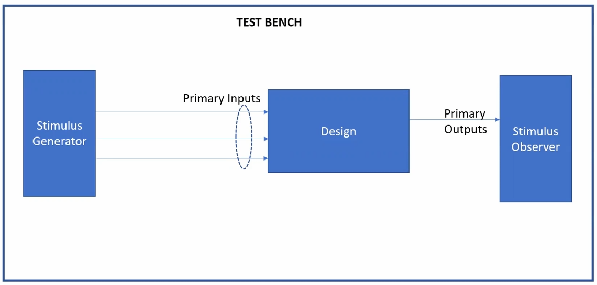
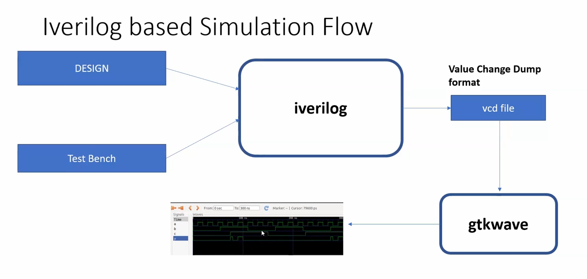
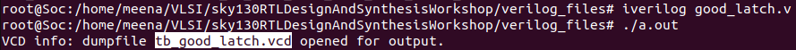
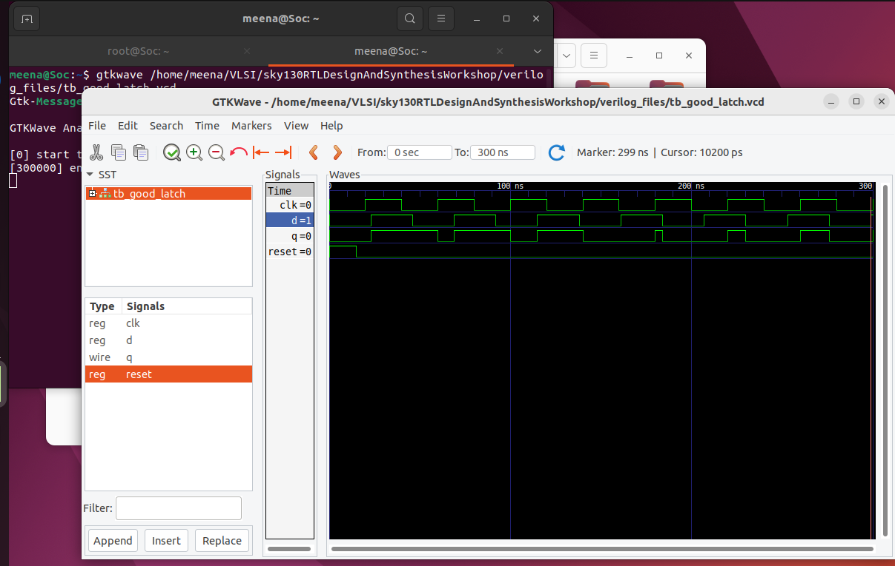

# Introduction to Verilog RTL Design and Synthesis

This day covers the topic of iverilog simulation and yosys 

>Note :
>Before proceeding with Verilog RTL design and synthesis, ensure the following tools are installed:
>- You have a Linux environment (Ubuntu 22.04 recommended).
>- Icarus Verilog simulator is installed and accessible.
>- GTKWave waveform viewer is configured.
>- Basic understanding of digital logic concepts.

## Table of Contents 

### [1. Introduction to iverilog simulator](#introduction-to-open-source-simulator-iverilog)
 - [What is Simulator, Design, Testbench?](#simulator)
 - [Simulation flow of iverilog](#iverilog-based-simulation-flow)
 - [D Latch execution - .v file](#d-latch-execution)
 - [Tool Setup](#environmental-setup)
 - [Simulation](#simulation)

### [2. Introduction to Yosys](Introduction_to_yosys.md)
 - [What is Synthesizing?](Introduction_to_yosys.md#1-what-is-synthesizing)
 - [Fast and slow cells of Liberty file](Introduction_to_yosys.md#2-liberty-lib-file-different-cells)
 - [Verification of Synthesis](Introduction_to_yosys.md#3-verification-of-synthesis)
 - [Synthesizing with Yosys](Introduction_to_yosys.md#4-synthesizing-with-yosys)
 - [Netlisting with Yosys](Introduction_to_yosys.md#netlisting-the-files)

# Introduction to Open-Source Simulator: iverilog

### Simulator

A **simulator** is a software tool that mimics the behavior of digital circuits by executing Verilog code and tracking signal changes over time.

Key characteristics of simulators include:

- Simulator monitors input signals and triggers output evaluation only when inputs change.
- No change in input signals results in no change in output signals.
- The simulator applies stimulus (set of test signals) to the design to test its behavior.

### Design

A **design** is the actual Verilog module that implements the intended digital functionality and contains primary inputs and outputs.

### Testbench

A **testbench** is a specialized Verilog module that creates a controlled environment to test and verify your design's functionality.

Testbench characteristics:

- Testbenches have no primary inputs or outputs - they generate everything internally.
- Creates and applies various input combinations to exercise the design.



## iverilog-Based Simulation Flow

The iverilog simulation process transforms Verilog code into visual waveform analysis through a systematic workflow.

### Simulation Process

1.Combine design and testbench files using iverilog compiler.

2.Create VCD files for signal analysis.

3.View results using GTKWave waveform viewer(Vim).



### Key Components

**VCD File (Value Change Dump)**: VCD files are industry-standard simulation dump files that record every signal transition during simulation.

**GTKWave** : GTKWave is a waveform viewer that transforms VCD data into interactive signal plots for design analysis and debugging.

## D Latch Execution
### Input , Output

How It Works

**Inputs:**

Clock Input: `clk`

Reset Input: `reset` (active-high)

Data Input: `d`

**Output:**

Registered Output: `q` 

### Verilog Code
```bash
module good_latch (input clk, input reset,input d , output reg q);
always @(clk,reset,d)
begin
     if(reset)
        q<=1'b0;
     else if(clk)
        q<=d;
end
endmodule
```
### Testbench Code
```bash
`timescale lns/lps
module tb_good_latch;
     reg clk,reset,d;
     wire q;
     good_latch uut(
          .clk(clk),
          .reset(reset),
          .d(d),
          .q(q)
     );
     initial begin
     $dumpfile("tb_good_latch.vcd");
     $dumpvars(0,tb_good_latch);
     clk=0;
     reset=1;
     d=0;
     #330 $finish;
     end
always  #20 clk=~clk;
always #23 d=~d;
always #15 reset=0;
endmodule
```

## Environmental Setup

| Command | Role |
|---------|---------------|
| cd VLSI | Create a directory |
| git clone https://github.com/kunalg123/sky130RTLDesignAndSynthesisWorkshop.git | Git Clone it to 'sky130RTLDesignAndSynthesisWorkshop.git'|
| cd /home/meena/VLSI/sky130RTLDesignAndSynthesisWorkshop/verilog_files # | Get into design folders |


## Simulation

| Command | Role |
|---------|---------------|
| iverilog good_latch.v tb_good_latch.v| Loading the latch into the simulator |
| ./a.out | Generating vcd file|
| gtkwave tb_good_latch.vcd | Output Waveform |



>vcd file is dumped to gtkwave for visualising the output.
>
>The output of D latch can be through the waveform.




