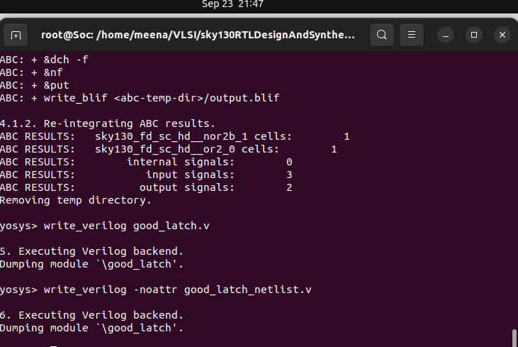

# Introduction to Yosys

## Table of Contents

[1. What is Synthesizing?](#1-what-is-synthesizing)  
[2. Fast and slow cells of Liberty file](#2-liberty-lib-file-different-cells)  
[3. Verification of Synthesis](#3-verification-of-synthesis)  
[4. Synthesizing with Yosys](#4-synthesizing-with-yosys)  
[5. Netlisting with Yosys](#netlisting-the-files)

---

## 1. What is Synthesizing?

**Design** - Behavioral representation of required specifications in Verilog code

**.lib** - Collection of logical modules (e.g., AND, OR, NOT gates, etc.)

**Netlist** - Verilog code representing the design in the form of standard cells

**Role of Synthesizer** - Convert RTL Design to Netlist (Gate level transition)

**Tool for Synthesizing** - Yosys


---

## 2. Liberty (.lib) File different cells 

Liberty files contain different cell flavors optimized for various design requirements:

| Cell Type | Speed | Power Consumption | Area | Use Case |
|-----------|-------|-------------------|------|----------|
| **Fast Cells** | High | High | Large | Timing-critical paths |
| **Slow Cells** | Low | Low | Small | Non-critical paths |

**Advantages of Different Cell Flavors:**
- **Fast Cells**: Better performance, meet tight timing constraints
- **Slow Cells**: Lower power consumption, smaller area
- **Mixed Use**: Optimize for power-performance-area tradeoffs

---

## 3. Verification of Synthesis


> **NOTE**:  
> - Stimulus should be same as output observed at RTL Simulation  
> - Same testbench should be used for verification

---

## 4. Synthesizing with Yosys

### Yosys Command Reference

| Command | Purpose | Role |
|---------|---------|------|
| `read_liberty -lib ../lib/sky130_fd_sc_hd__tt_025C_1v80.lib` | Start Yosys and Read Library | Provides cell information for mapping |
| `read_verilog good_mux.v` | Read RTL design | Loads Verilog code into synthesizer |
| `synth -top good_latch` | Synthesize design | Converts RTL to generic gates |
| `abc -liberty ../lib/sky130_fd_sc_hd__tt_025C_1v80.lib` | Library cells mapping | Maps generic gates to library cells |
| `show` | Display schematic | Generates graphical netlist view |
| `write_verilog good_latch_netlist.v` | Write netlist with attributes | Saves netlist with synthesis attributes |
| `!gvim good_latch_netlist.v` | Open netlist in GVim	| View and edit the generated netlist |
| `write_verilog -noattr good_latch_netlist.v` | Write clean netlist | Saves netlist without synthesis attributes |
| `!gvim good_latch_netlist.v` | View clean netlist | Open the cleaned netlist in GVim |

**Synthesizing the commands**


**Mapping library cells**


**Display Schematic**


## **Netlisting the files**


**After adding a switch as instantiator**
```bash
module good_latch(clk, reset, d, q);
  wire _0_;
  wire _1_;
  wire _2_;
  wire _3_;
  wire _4_;
  wire _5_;
  wire _6_;
  input clk;
  input d;
  output q;
  input reset;
  sky130_fd_sc_hd__nor2b_1 _7_ (
    .A(_6_),
    .B_N(_5_),
    .Y(_2_)
  );
  sky130_fd_sc_hd__or2_0 _8_ (
    .A(_6_),
    .B(_4_),
    .X(_3_)
  );
  `\$_DLATCH_P`_  _9_ (
    .D(_0_),
    .E(_1_),
    .Q(q)
  );
  assign _5_ = d;
  assign _6_ = reset;
  assign _0_ = _2_;
  assign _4_ = clk;
  assign _1_ = _3_;
endmodule
```
