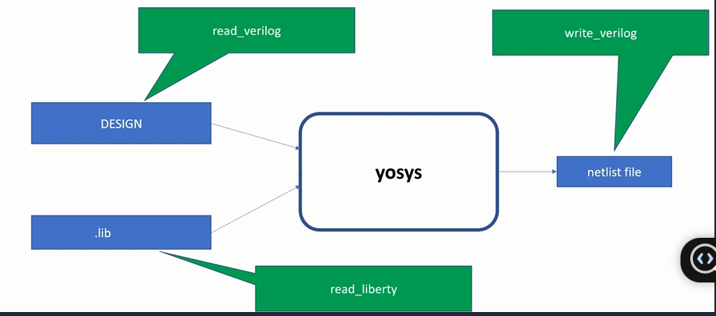

# Introduction to Yosys

## Table of Contents

[1. What is Synthesizing?](#1-what-is-synthesizing)  
[2. Constraints](#2-constraints)  
[3. Verification of Synthesis](#3-verification-of-synthesis)  
[4. Synthesizing with Yosys](#4-synthesizing-with-yosys)

---

## 1. What is Synthesizing?

**Design** - Behavioral representation of required specifications in Verilog code

**.lib** - Collection of logical modules (e.g., AND, OR, NOT gates, etc.)

**Netlist** - Verilog code representing the design in the form of standard cells

**Role of Synthesizer** - Convert RTL Design to Netlist (Gate level transition)

**Tool for Synthesizing** - Yosys

---

## 2. Constraints

### Liberty (.lib) File Flavors

Liberty files contain different cell flavors optimized for various design requirements:

| Cell Type | Speed | Power Consumption | Area | Use Case |
|-----------|-------|-------------------|------|----------|
| **Fast Cells** | High | High | Large | Timing-critical paths |
| **Slow Cells** | Low | Low | Small | Non-critical paths |

**Advantages of Different Cell Flavors:**
- **Fast Cells**: Better performance, meet tight timing constraints
- **Slow Cells**: Lower power consumption, smaller area
- **Mixed Use**: Optimize for power-performance-area tradeoffs

---

## 3. Verification of Synthesis

> **NOTE**:  
> - Stimulus should be same as output observed at RTL Simulation  
> - Same testbench should be used for verification

---

## 4. Synthesizing with Yosys

### Yosys Command Reference

| Command | Purpose | Role |
|---------|---------|------|
| `read_liberty -lib ../lib/sky130_fd_sc_hd__tt_025C_1v80.lib` | Start Yosys and Read Library | Provides cell information for mapping |
| `read_verilog good_mux.v` | Read RTL design | Loads Verilog code into synthesizer |
| `synth -top good_latch` | Synthesize design | Converts RTL to generic gates |
| `abc -liberty ../lib/sky130_fd_sc_hd__tt_025C_1v80.lib` | Generate Netlist | Maps generic gates to library cells |
| `show` | Display schematic | Generates graphical netlist view |

**Synthesizing the commands**

**Netlisted Code**

**Display Schematic**

