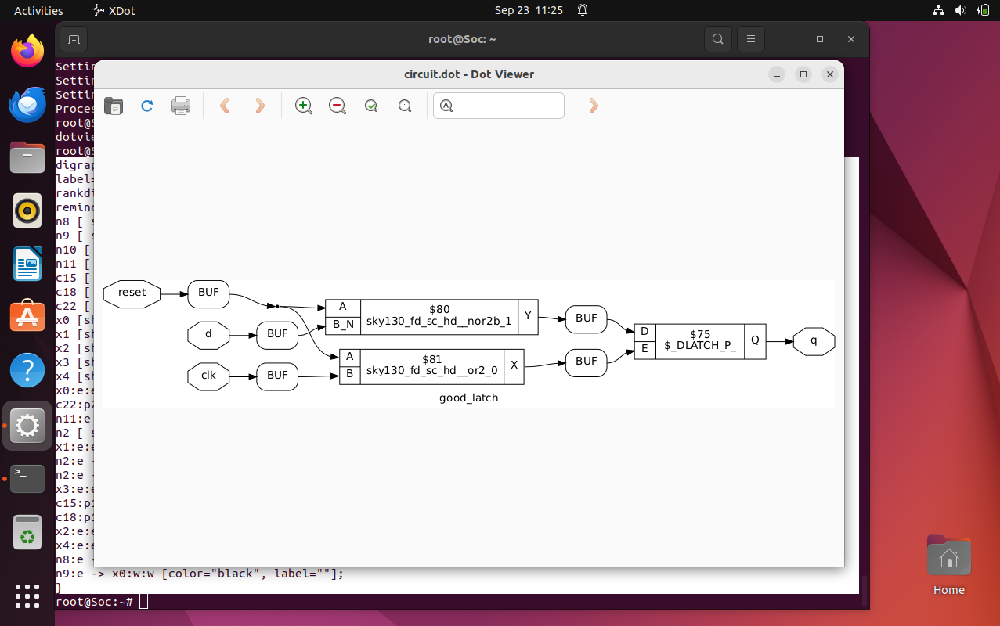

# Introduction to yosys

## Table of Contents 

  [1. What is synthesizing ?](#what-is-synthesizing-?) 
  
  [2. Constraints](#constraints)
  
  [3. Verification of Synthesis](#verification-of-synthesis)
  
  [4. Synthesizing](#synthesizing)
 
---
## What is Synthesizing ? 

**Design** - Behavioural Representation of requireed specifications in verilog code

**.lib** - Collection of logical modules . Eg : and , or , not gate etc.. 

**Netlist** - Verilog code representing the design in the form of standard cells 

**ROLE OF SYNTHESIZER** - To convert RTL Design to Netlist (Gate level Transition) 

**TOOL FOR SYNTHESIZING** - yosys


## Contraints

## Verification of Synthesis 

>**NOTE**
>Stimulus should be same as output observed at RTL Simulation
>Same testbench should be used for verification


## Synthesizing

**1. Get into the design folders and enter into the tool yosys**
**2. Read the library file .lib**
```bash
read_liberty -lib ../lib/sky130_fd_sc_hd__tt_025C_1v80.lib
```
**3. Read the RTL design code**

>**NOTE**
>We should not get any error.
>It should get a final statement as frontend completed

```bash
read_verilog good_mux.v
```
**4. Synthesizing using Yosys**
```bash
synth -top good_latch
```


**5. Netlisting it**
```bash
abc -liberty ../ib/sky130_fd_sc_hd__tt_025C_1v80.lib
```


>**Netlisted code**
>
>
>
>**Netlist Output**
>

**6. Viewing the Graphical Version**
```bash
show
```



