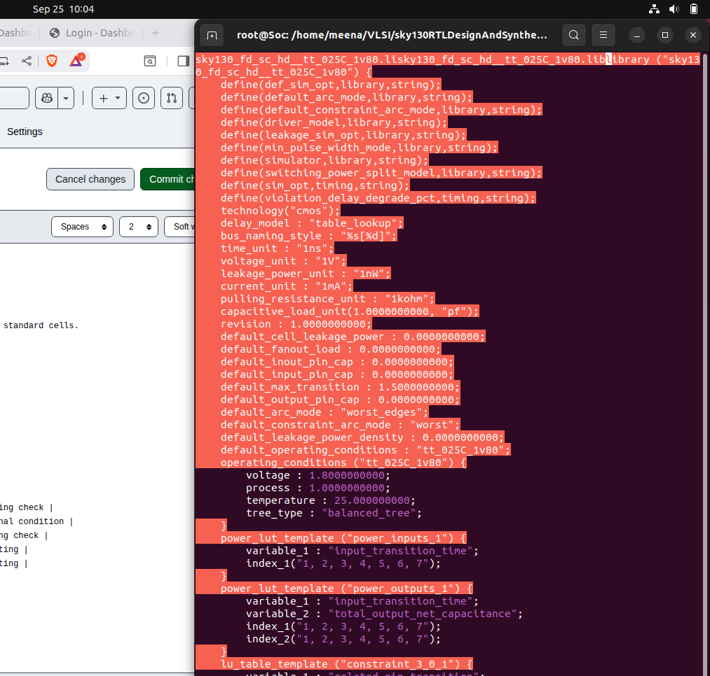
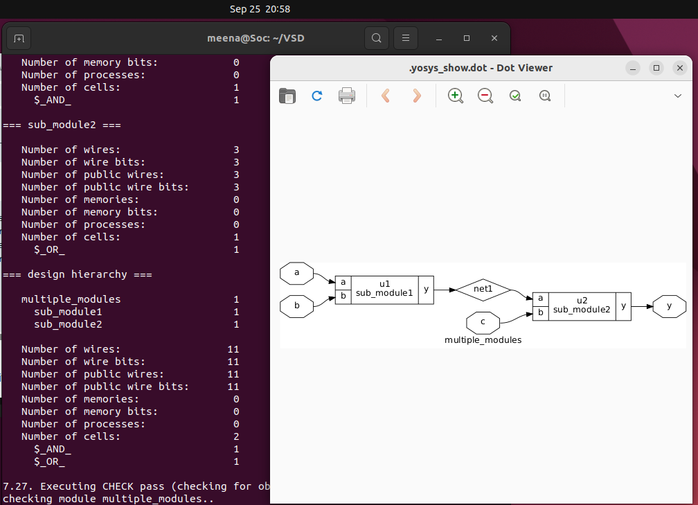
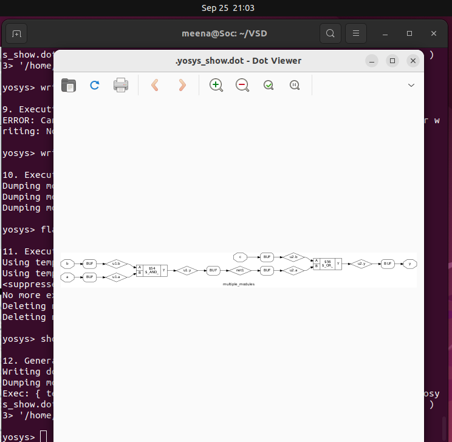
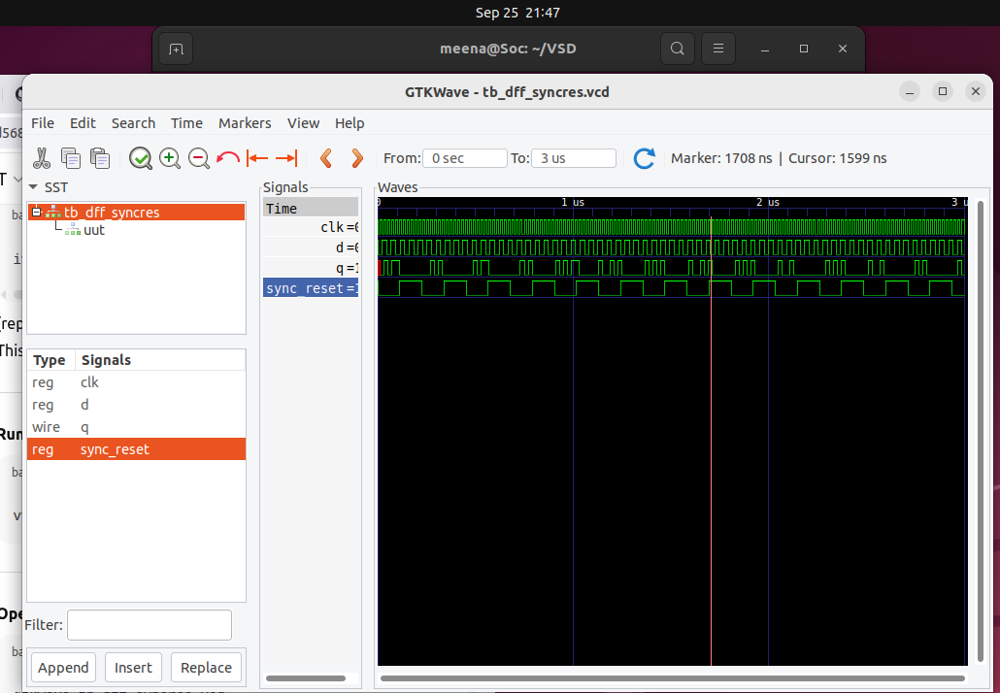

# RISC-V SoC Day 2: Timing Libraries, Synthesis & Flip-Flop Design

This guide covers timing libraries, synthesis methodologies, and efficient flip-flop coding for RISC-V SoC design using the SKY130 PDK.

## 📑 Table of Contents

📌 [Timing Libraries](#timing-libraries)  

📌 [Hierarchical vs Flat Synthesis](#hierarchical-vs-flat-synthesis)  

📌 [Flip-Flop Coding Styles](#flip-flop-coding-styles)  
 
📌 [Simulation & Synthesis Workflow](#simulation--synthesis-workflow)  
 
📌 [Optimization Techniques](#optimization-techniques)  

📌 [Summary](#summary)  


## Timing Libraries

### SKY130 PDK Overview

| Component | Description |
|-----------|-------------|
| **PDK** | SkyWater 130nm open-source process |
| **Library** | `sky130_fd_sc_hd__tt_025C_1v80.lib` |
| **Process** | tt = Typical-Typical corner |
| **Temperature** | 025C = 25°C |
| **Voltage** | 1v80 = 1.8V |

### Understanding .lib Files

A `.lib` file contains timing and characterization data for standard cells.

**Opening the library file:**
```verilog
cd ~/VLSI/sky130RTLDesignAndSynthesisWorkshop/lib
gvim sky130_fd_sc_hd__tt_025C_1v80.lib
```


### PVT Corners

| Corner | Process | Voltage | Temperature | Use Case |
|--------|---------|---------|-------------|----------|
| **SS** | Slow NMOS, Slow PMOS | 1.60V | 125°C | Setup timing check |
| **TT** | Typical NMOS, Typical PMOS | 1.80V | 25°C | Nominal condition |
| **FF** | Fast NMOS, Fast PMOS | 1.95V | -40°C | Hold timing check |
| **SF** | Slow NMOS, Fast PMOS | 1.80V | 25°C | Stress testing |
| **FS** | Fast NMOS, Slow PMOS | 1.80V | 25°C | Stress testing |

## Hierarchical vs Flat Synthesis

### Example Design: multiple_modules.v
```bash
module sub_module1 (input a, input b, output y);
assign y = a & b;
endmodule

module sub_module2 (input a, input b, output y);
assign y = a | b;
endmodule

module multiple_modules (input a, input b, input c, output y);
wire net1;
sub_module1 u1(.a(a), .b(b), .y(net1));
sub_module2 u2(.a(net1), .b(c), .y(y));
endmodule
```

### Hierarchical Synthesis
---

**Advantages:**
- Preserves module structure
- Easier debugging
- Better for large designs
- Module reusability

**Yosys Commands:**
```verilog
yosys
read_liberty -lib ~/VLSI/sky130RTLDesignAndSynthesisWorkshop/lib/sky130_fd_sc_hd__tt_025C_1v80.lib
read_verilog ~/VLSI/sky130RTLDesignAndSynthesisWorkshop/verilog_files/multiple_modules.v
synth -top multiple_modules
abc -liberty ~/VLSI/sky130RTLDesignAndSynthesisWorkshop/lib/sky130_fd_sc_hd__tt_025C_1v80.lib
show multiple_modules
write_verilog multiple_modules_hier.v
```


### Flat Synthesis

**Advantages:**
- Cross-module optimization
- Better area/timing optimization
- Single unified netlist

**Yosys Commands:**
```bash
yosys
read_liberty -lib ~/VLSI/sky130RTLDesignAndSynthesisWorkshop/lib/sky130_fd_sc_hd__tt_025C_1v80.lib
read_verilog ~/VLSI/sky130RTLDesignAndSynthesisWorkshop/verilog_files/multiple_modules.v
synth -top multiple_modules
abc -liberty ~/VLSI/sky130RTLDesignAndSynthesisWorkshop/lib/sky130_fd_sc_hd__tt_025C_1v80.lib
flatten
show multiple_modules
write_verilog multiple_modules_flat.v
```


### Submodule Level Synthesis 
**Command Overview**

| Command | Function |
|---------|----------|
| `yosys` | Launches the Yosys synthesis tool |
| `read_liberty -lib ../lib/sky130_fd_sc_hd__tt_025C_1v80.lib` | Reads the standard cell library |
| `read_verilog multiple_modules.v` | Loads the Verilog design file |
| `synth -top submodule1` | Synthesizes only the specified submodule |
| `abc -liberty ../lib/sky130_fd_sc_hd__tt_025C_1v80.lib` | Technology mapping for the submodule |
| `show` | Displays the synthesized submodule |

### Why Submodule Level Synthesis?

**Reason 1: Multiple Instances**
- Preferred when design contains **multiple instances** of the same module
- Enables **optimized reuse** of synthesized blocks

**Reason 2: Massive Designs**
- For **large-scale designs**, submodule synthesis enables **divide and conquer** strategy
- Improves **synthesis runtime** and **memory efficiency**
- Facilitates **parallel synthesis** workflows
- 

### Comparison Table

| Aspect | Hierarchical | Flat |
|--------|-------------|------|
| **Structure** | Preserves modules | Single flat netlist |
| **Optimization** | Local per module | Global across design |
| **Debugging** | Easier | Harder |
| **Runtime** | Faster for large designs | Slower for large designs |
| **Use Case** | Modular design | Maximum optimization |

## Flip-Flop Coding Styles

### Asynchronous Reset D Flip-Flop
```bash
module dff_asyncres (
input clk,
input async_reset,
input d,
output reg q
);
always @(posedge clk, posedge async_reset)
if (async_reset)
q <= 1'b0;
else
q <= d;
endmodule
```
### Synchronous Reset D Flip-Flop
```bash
module dff_syncres (
input clk,
input sync_reset,
input d,
output reg q
);
always @(posedge clk)
begin
if (sync_reset)
q <= 1'b0;
else
q <= d;
end
endmodule
```

### Asynchronous and Synchronous Reset D Flip-Flop
```bash
module dff_asyncres_syncres (
input clk,
input async_reset,
input sync_reset,
input d,
output reg q
);
always @(posedge clk, posedge async_reset)
begin
if (async_reset)
q <= 1'b0;
else if (sync_reset)
q <= 1'b0;
else
q <= d;
end
endmodule
```
## Simulation & Synthesis Workflow

### Simulation with Icarus Verilog
```

iverilog dff_asyncres.v tb_dff_asyncres.v #Compile
./a.out #Run simulation
gtkwave tb_dff_asyncres.vcd  #View waveform
```


### Synthesis with Yosys
```
yosys
read_liberty -lib ~/VLSI/sky130/file/sky130_fd_sc_hd__tt_025C_1v80.lib
read_verilog dff_asyncres.v
synth -top dff_asyncres
dfflibmap -liberty ~/VLSI/sky130/file/sky130_fd_sc_hd__tt_025C_1v80.lib
abc -liberty ~/VLSI/sky130/file/sky130_fd_sc_hd__tt_025C_1v80.lib
show
```


### Why dfflibmap is Important

| Without dfflibmap | With dfflibmap |
|------------------|----------------|
| Generic flip-flops ($dff, $adff) | Standard cell flip-flops |
| Cannot be mapped by abc | Properly mapped to library |
| Incomplete netlist | Complete synthesized netlist |

## Optimization Techniques

### Special Case 1: Multiplication by Powers of 2
```
// A * 2^n = A << n (left shift)
// No hardware multipliers needed
assign result = a << 3; // Multiply by 8
```

### Special Case 2: Multiplication by 9
```
// A * 9 = A * (8 + 1) = (A << 3) + A
assign result = (a << 3) + a;
```

### Boolean Logic Optimization

| Input Logic | Optimized Form |
|-------------|----------------|
| `a ? (b ? c : (c ? a : 0)) : (!c)` | `a XNOR c` |
| `(A & B) NOR C` when A=0 | `!C` |

### Sequential Constant Propagation

- Flip-flops with constant inputs can be optimized away
- Only applies when output is truly constant
- Clock and reset variations don't affect optimization

### NAND vs NOR Gate Preference

| Gate Type | PMOS Configuration | Performance |
|-----------|-------------------|-------------|
| **NAND** | Parallel PMOS | Fast pull-up |
| **NOR** | Series PMOS | Slow pull-up |

**Why NAND is preferred:**
- PMOS devices have lower mobility than NMOS
- Series PMOS in NOR gates create resistance stacking
- NAND gates scale better with multiple inputs

## Summary

### Key Learning Points

1. **Timing Library Analysis**: Successfully explored SKY130 PDK `.lib` files to understand PVT corners (Process, Voltage, Temperature) and their impact on design characterization across different operating conditions.

2. **Synthesis Methodology Comparison**: Implemented and compared hierarchical vs flat synthesis approaches, demonstrating how hierarchical synthesis preserves module boundaries for easier debugging while flat synthesis enables global optimization.

3. **Flip-Flop Design Implementation**: Developed and synthesized multiple flip-flop coding styles including asynchronous reset, synchronous reset, and combined reset configurations with proper Yosys synthesis workflows.

4. **Optimization Techniques Mastery**: Applied various optimization strategies including multiplication by powers of 2 using bit shifting, Boolean logic simplification, and sequential constant propagation for efficient hardware implementation.
