# Day 3: Combinational and Sequential Optimization

Welcome to Day 3 of this workshop! Today we discuss optimization of combinational and sequential circuits, introducing techniques to enhance efficiency and performance.

---

## Table of Contents

- [Combinational Logic Optimisation](#combinational-logic-optimisation)
- [Sequential Logic Optimization](#sequential-logic-optimization)
- [Yosys Optimization Commands](#yosys-optimization-commands)
- [Labs on Combinational Logic Optimization](#labs-on-combinational-logic-optimization)
- [Labs on Sequential Logic Optimization](#labs-on-sequential-logic-optimization)
- [Summary](#summary)

---

## COMBINATIONAL LOGIC OPTIMISATION

## Objective
Squeeze and simplify logic to get the most optimized design in terms of area and power.

## 1. Constant Propagation
**Definition:**  
When input signals or internal signals are assigned constant values, the synthesis tool replaces those signals with their constant equivalents and simplifies the logic around them.

**How it works:**
- Detects nets or variables that always hold a constant (0, 1, or fixed value)
- Propagates that constant through the circuit
- Removes gates or logic that become redundant

**Example:**
Y = ((A·B) + C)'
If A = 0 → Y = (0 + C)' = C'

**Result:** Complex gate logic (6 MOS transistors) simplifies to a single inverter (2 MOS transistors).

**Benefits:**
- Reduces gate count and power usage
- Simplifies design, enabling further optimizations
- Improves area and power efficiency

## 2. Boolean Logic Optimization

**Purpose:**
- Minimize gates
- Reduce delay
- Save power
- Improve readability

**Methods:**
- **Algebraic Simplification**: Apply Boolean laws (e.g., `A + A' = 1`, `A·1 = A`)
- **Karnaugh Map (K-Map)**: Visual grouping to simplify expressions
- **Quine-McCluskey Method**: Tabular method for systematic simplification

**Example:**
assign y = a ? (b ? c : (c ? a : 0)) : (!c);

**Optimized:**  
y = a ⊕ c

---

## SEQUENTIAL LOGIC OPTIMIZATION

Sequential optimization techniques ensure faster, smaller, and power-efficient circuits.

## 1. State Optimization

**Definition:**  
Reduces the number of states in a finite state machine (FSM) by merging equivalent or unreachable states.

**Techniques:**
- **Unreachable state removal**: Eliminates states that cannot be reached
- **Equivalent state merging**: Combines states that behave identically
- **State re-encoding**: Changes encoding scheme for optimal area vs. speed

**Advantages:**
- Reduces flip-flop count
- Improves timing (fewer state transitions)
- Lower area and power usage

## 2. Cloning

**Definition:**  
Duplicate logic or registers to reduce fanout and improve timing.

**How it works:**
- If a single gate drives many loads, delay increases
- Cloning creates copies so loads are split between them
- Each duplicated instance drives a subset of the loads

**Advantages:**
- Reduces net delay from high fanout
- Improves timing closure
- Helps achieve higher operating frequency

## 3. Retiming

**Definition:**  
Reposition registers (flip-flops) in a circuit without changing functionality.

**How it works:**
- Moves flip-flops across logic gates
- Balances combinational delays
- Preserves overall input-output behavior

**Advantages:**
- Optimizes critical path delay
- Enables higher clock frequency
- Balances pipeline stages for better performance

---

## YOSYS OPTIMIZATION COMMANDS

**Logic optimization:**
```
opt_clean -purge
```

**For hierarchical designs:**
```
flatten
synth -top <module_name>
opt_clean -purge
```

> **Note:**
> -`opt_clean -purge` performs complete optimization and cleanup:
> - Removes unused wires, cells, and trivial logic
> - Completely removes anything not connected to outputs
> - Results in smaller, cleaner netlists

---

## LABS ON COMBINATIONAL LOGIC OPTIMIZATION

**Setup**
```
cd ~/VLSI/sky130RTLDesignAndSynthesisWorkshop/verilog_files
```
**List designs:**
```
ls opt #combinational
ls dff #sequential
```

## Lab 1: opt_check.v

**View the Verilog code:**
```
gedit opt_check.v
```

**Verilog Code:**      

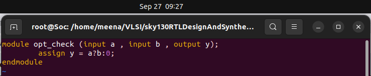

**Functionality:** 
if `a` is true, `y` is `b`; else `y` is 0. Essentially `y = a & b`.

**Synthesis:**
```
yosys
read_liberty -lib ~/vsd/VLSI/sky130RTLDesignAndSynthesisWorkshop/lib/sky130_fd_sc_hd__tt_025C_1v80.lib
read_verilog opt_check.v
synth -top opt_check
opt_clean -purge
abc -liberty ~/vsd/VLSI/sky130RTLDesignAndSynthesisWorkshop/lib/sky130_fd_sc_hd__tt_025C_1v80.lib
show
exit
```

**Statistics:**    
```
=== opt_check ===

   Number of wires:                  3
   Number of wire bits:              3
   Number of public wires:           3
   Number of public wire bits:       3
   Number of memories:               0
   Number of memory bits:            0
   Number of processes:              0
   Number of cells:                  1
     $_AND_                          1
```

**Netlist dot file**      

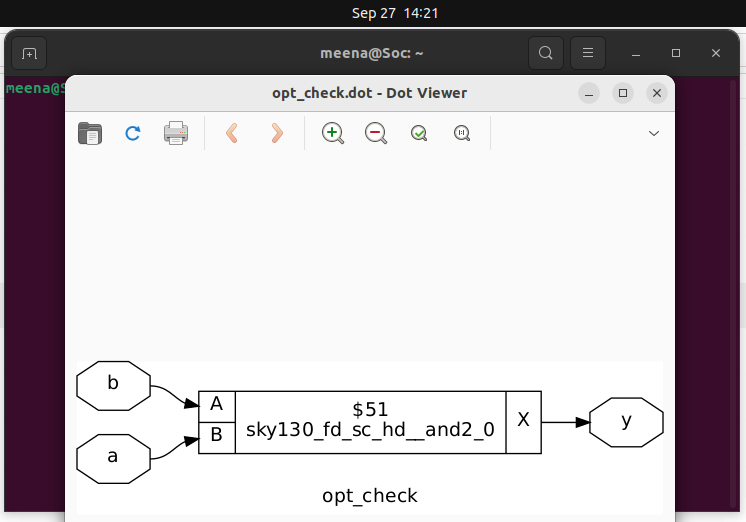

## Lab 2: opt_check2.v

**Verilog Code:**

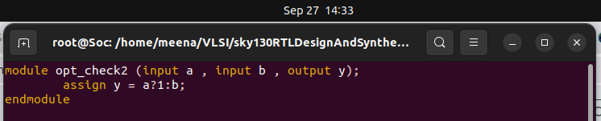

**Functionality:** 
if `a` is true, output is 1; else output is `b`. Essentially `y = a | b`.

**Statistics:**  
```
=== opt_check2 ===

   Number of wires:                  3
   Number of wire bits:              3
   Number of public wires:           3
   Number of public wire bits:       3
   Number of memories:               0
   Number of memory bits:            0
   Number of processes:              0
   Number of cells:                  1
     $_OR_                           1
```

**Netlist dot file**

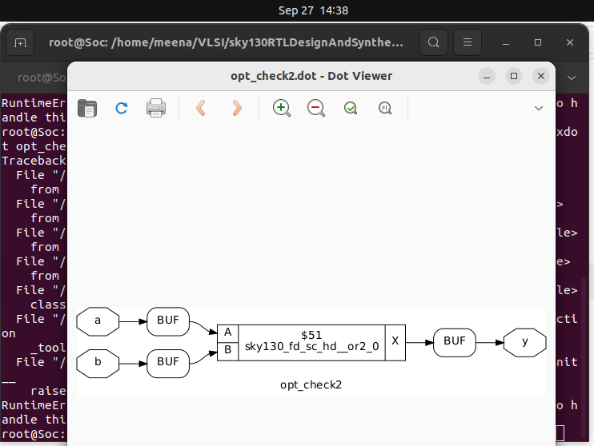

## Lab 3: opt_check3.v

**Verilog Code:**

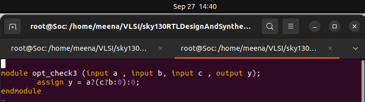

**Functionality:**  
if `a` and `c` are true, output is `b`; else output is 0. Essentially `y = a & b & c`.

**Statistics:**  
```
=== opt_check3 ===

   Number of wires:                  5
   Number of wire bits:              5
   Number of public wires:           4
   Number of public wire bits:       4
   Number of memories:               0
   Number of memory bits:            0
   Number of processes:              0
   Number of cells:                  2
     $_ANDNOT_                       1
     $_NAND_                         1
```
**Netlist dot file**

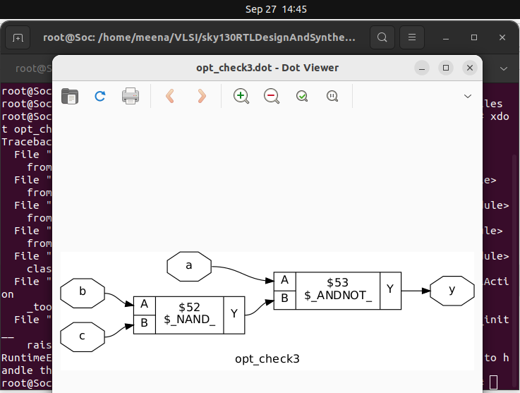

---
## LABS ON SEQUENTIAL LOGIC OPTIMIZATION

## Lab 4: dff_const1.v

**Verilog Code:**

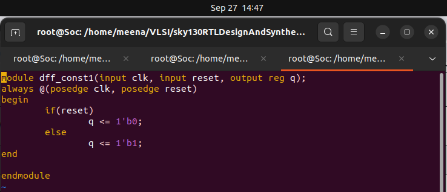

**Functionality:**  
- D flip-flop with asynchronous reset  
- When reset is high, output `q` is 0  
- When reset is low, output `q` is 1

**Synthesis:**
```
yosys
read_liberty -lib ../lib/sky130_fd_sc_hd__tt_025C_1v80.lib
read_verilog dff_const1.v
synth -top dff_const1
dfflibmap -liberty ../lib/sky130_fd_sc_hd__tt_025C_1v80.lib
abc -liberty ../lib/sky130_fd_sc_hd__tt_025C_1v80.lib
show
```
**Statistics**
```
=== dff_const1 ===

   Number of wires:                  3
   Number of wire bits:              3
   Number of public wires:           3
   Number of public wire bits:       3
   Number of memories:               0
   Number of memory bits:            0
   Number of processes:              0
   Number of cells:                  1
     $_DFF_PP0_                      1
```
**Netlist dot File**

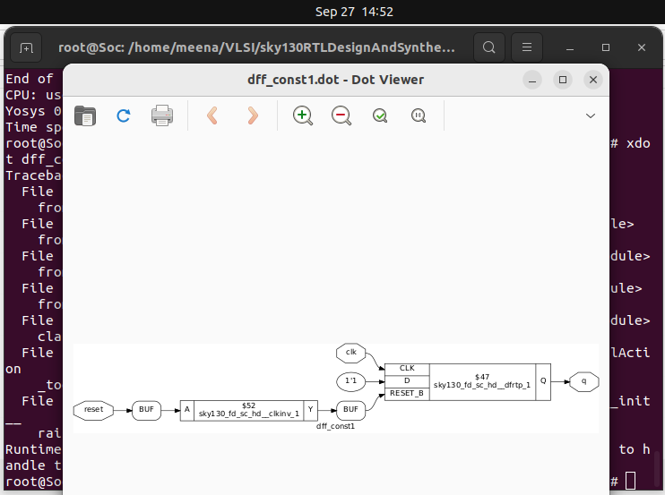

## Lab 5: dff_const2.v

**Verilog Code:**

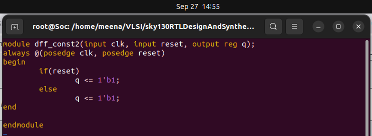

**Functionality:**  
- Output `q` is always 1, regardless of clock or reset  
- This optimizes to a constant logic 1

**Statistics**
```
=== dff_const2 ===

   Number of wires:                  3
   Number of wire bits:              3
   Number of public wires:           3
   Number of public wire bits:       3
   Number of memories:               0
   Number of memory bits:            0
   Number of processes:              0
   Number of cells:                  0
```

**Netlist dot file**

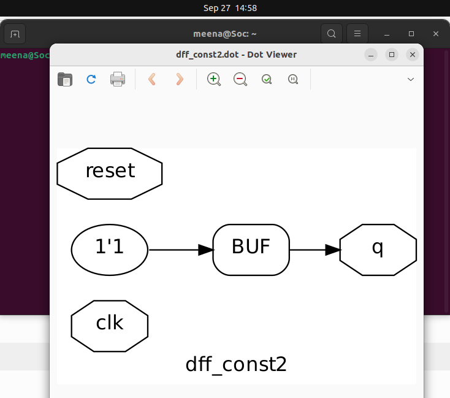

## Lab 6: dff_const3.v

**Verilog Code:**


**Functionality:** 
- Two flip-flops with different reset values  
- `q` takes the previous value of `q1`  
- After reset: `q` outputs 0 on first clock, then 1 on subsequent clocks

**Statistics**
```
=== dff_const3 ===

   Number of wires:                  4
   Number of wire bits:              4
   Number of public wires:           4
   Number of public wire bits:       4
   Number of memories:               0
   Number of memory bits:            0
   Number of processes:              0
   Number of cells:                  2
     $_DFF_PP0_                      1
     $_DFF_PP1_                      1
```

**Netlist dot file**

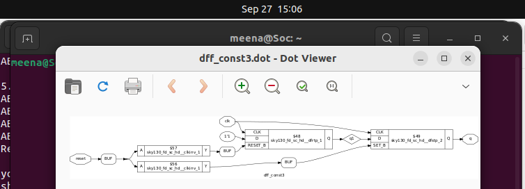

---

## SUMMARY

**Combinational Optimization Techniques:**  
- Constant Propagation: Replaces logic with constants → fewer gates, less power  
- Boolean Logic Optimization: Simplifies logic expressions with techniques like K-Map/Quine-McCluskey

**Sequential Optimization Techniques:**  
- State Optimization: Minimizes FSM states → reduces flip-flops and transitions  
- Retiming: Moves registers to balance delay → improves timing  
- Cloning: Duplicates logic/registers to reduce fanout → helps timing closure

**Key Yosys Commands:**  
- flatten: Converts hierarchical design into flat design  
- opt_clean -purge: Removes unused nets and redundant logic  
- dfflibmap / abc: Logic mapping to technology libraries

**Lab Outcomes:**  
- Optimized designs show reduced transistor count and area  
- Some flip-flops collapse into constants, saving resources  
- Visualized netlists confirm simplifications in synthesized designs

By applying these optimization techniques, designs become smaller, faster, and more power-efficient, ready for real-world VLSI implementation.
