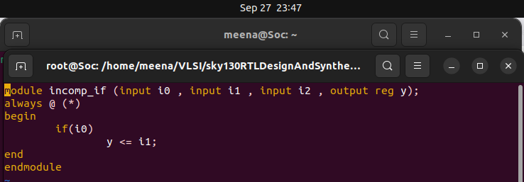
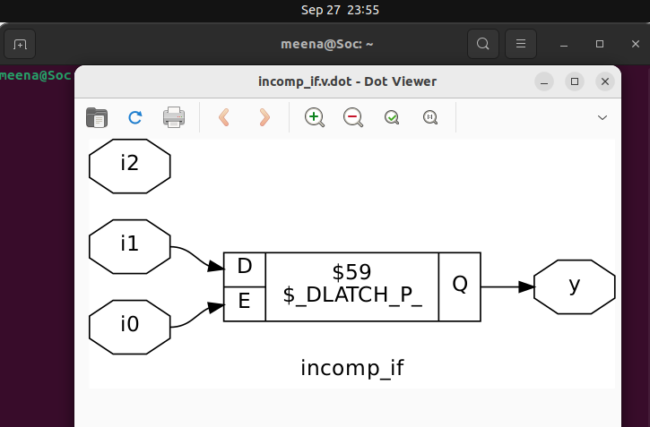

# Day 5 - If-Case Constructs, For Loops, and Generate Statements in Verilog

Welcome to Day 5 of the RTL Design Workshop! This session covers essential Verilog constructs to write efficient and flexible RTL code:
- `if-else` and `case` statements for conditional logic
- `for` loops for repetitive hardware generation
- `generate` blocks for parameterized module instantiation

## Table of Contents

1. [Conditional Statements in Verilog](#1-conditional-statements-in-verilog)
2. [For Loops and Generate Statements](#2-for-loops-and-generate-statements)
3. [Labs](#3-labs)
4. [Summary](#4-summary)

---

## 1. Conditional Statements in Verilog

### 1.1 If-Else Statements

- Used for synthesizable conditional logic based on signal values
- Supports nested conditions for complex decision structures
- Typically used in combinational or sequential always blocks
- Syntax example:
```
always @(*) begin
if (sel == 1'b0)
y = a;
else
y = b;
end
```

- For synthesis, avoid constructs that infer latches by ensuring all branches assign outputs.

### 1.2 Case Statements

- Cleaner syntax for multi-way branching
- Supports exact, wildcard (`casex`), or ignore-case (`casez`) matching
- Useful for FSM implementations and wide selection logic
```
always @(*) begin
case(opcode)
2'b00: y = a;
2'b01: y = b;
2'b10: y = c;
default: y = 1'b0;
endcase
end
```
---

## 2. For Loops and Generate Statements

### 2.1 For Loops

- Use `for` loops in RTL to write repetitive hardware succinctly
- Allowed only in synthesizable constructs, typically inside always blocks or initial blocks for testbenches
- Example: initializing array elements, generating counters
```
integer i;
always @(*) begin
for (i = 0; i < 8; i = i + 1)
out[i] = in[i] & mask[i];
end
```

### 2.2 Generate Statements

- Used to conditionally or iteratively instantiate multiple module instances or RTL blocks
- Generate blocks run at elaboration time, producing multiple hardware copies
- Supports `generate`, `genvar`, and `endgenerate`
- Example: generate multiple flip-flops based on a parameter
```
genvar i;
generate
for (i=0; i<8; i=i+1) begin : gen_flops
dff flop (.clk(clk), .d(d[i]), .q(q[i]));
end
endgenerate
```
---

## 3. Labs

### 3.1 Lab 1: If-Case Implementation

- Implement a 4-to-1 multiplexer using `if-else` and verify functionality
- Implement the same mux with a `case` statement
- Compare synthesis result and simulation waveforms

**Verilog Code**



**Gtkwave**


**Statistics**
```
=== incomp_if ===

   Number of wires:                  4
   Number of wire bits:              4
   Number of public wires:           4
   Number of public wire bits:       4
   Number of memories:               0
   Number of memory bits:            0
   Number of processes:              0
   Number of cells:                  1
     $_DLATCH_P_                     1
```

**Netlist dot file**




### 3.2 Lab 2: For Loop Based Register File

- Use a `for` loop to instantiate an array of registers
- Demonstrate writing and reading from the register array using indexed signals
- Verify single-port register file operation with testbench

### 3.3 Lab 3: Generate Block for Parameterized Module

- Create a parameterized adder module
- Use `generate` block to instantiate multiple adders based on a parameter
- Simulate the design with different parameter values to verify scalability and correctness

---

## 4. Summary

- Verilog `if-else` and `case` statements enable conditional hardware specification, essential for combinational and sequential logic design.
- `for` loops simplify repetitive hardware definitions within procedural blocks, improving readability and maintainability.
- `generate` blocks enable flexible, parameterized hardware replication during elaboration, supporting scalable design architectures.
- Adopting these constructs thoughtfully leads to clean RTL that is easier to synthesize, simulate, and debug.

---

> **Tip:** Always ensure that combinational blocks fully specify outputs on all paths to avoid inferred latches. Use case and if constructs judiciously to maintain clear, synthesizable RTL.

---
